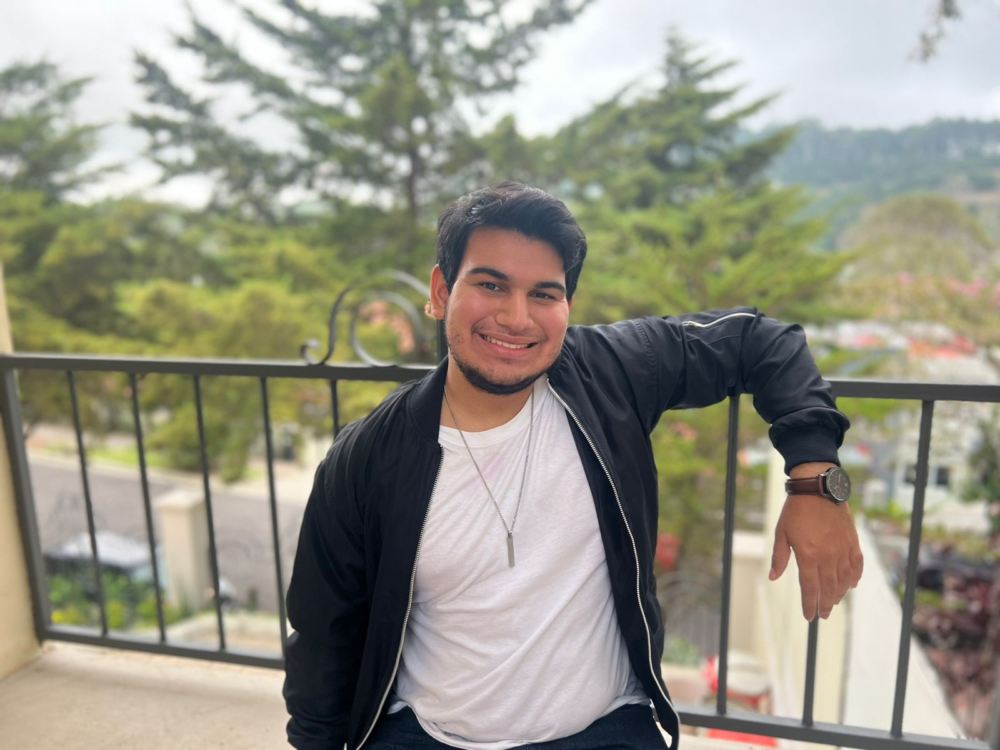

# Linea De Tiempo Javier Cader `:bowtie:`

* ## Datos Bibliográficos 
  **Nombre:** Javier Enrique Cader Suay  
  **Ocupación:** Estudiante de Ingeniería Informática  
  **Padre:** Aldo Cader Camilot    
  **Madre:** Vilma Suay Orellana  
  **Ciudad Natal:** San Salvador, El Salvador  
  **Nacimiento:** *20 de febrero de 2004*

* ## Estudios
  -Colegio Salvadoreño Inglés *(2008-2022)*  
  -Curso de Javascript Domestika *(2020)*  
  -Cuso de Responsive Web Development Domestika *(2022)*  
  -Curso de ReactJS Udemy *(2021)*  
  -Curso de Web Development Mimo *(2020)*  
  -Curso de Python Mimo *(2020)*  

* ## Proyectos
  -[Pagina Web Global Language Center *(2022)*](https://thegloballanguagecenter.studio/) `:earth_americas:`  
  -[Real-Time Chat app de Global Language Center *(2022)*](https://glc-chat-app.netlify.app/) `:incoming_envelope:`  
  -[Proyecto de Pagina Web de Compras Para Colegio Salvadoreño Inglés *(2022)*](https://ecommerce-sanity-delta.vercel.app/) `:money_with_wings:`

* ## Intereses
  
  | Interests          |      Tools     |  Year |
  |--------------------|:-------------: |------:|
  | Web Dev            |  ReactJS, SASS | 2022  |
  | Game Dev           |  Unity, Pygame | 2022  |
  | Simulaciones       |  Pymunk, p5.js | 2022  |
  | Edicion de Imagenes|  Photoshop     | 2021  |
  | Modelado 3D        |  Cinema4D      | 2021  |
  | Animaciones 2D     |  After Effects | 2021  |

* ## Yo
  <kbd></kbd>
