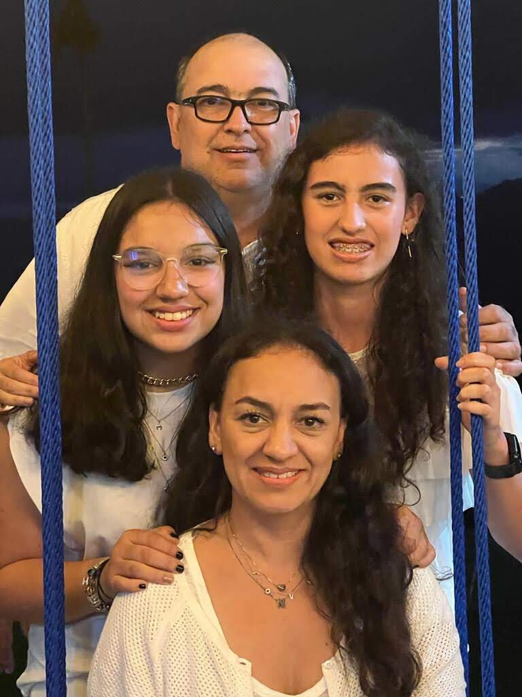

## línea de tiempo de Valentina Arias Salazar

- Fecha de nacimiento: 26/06/2003
- Nacionalidad: Colombiana
- Género: Femenina

# Sobre mí

vivía con mis papas, mi abuela y mi hermana en la ciudad de Medellín en el poblado, mi mayor pasión ha sido el futbol, pero me gustan todos los deportes.
Siempre me han gustado mucho los videojuegos y los computadores, también las matemáticas y aprender cosas nuevas todos los días. Mi familia es unida y siempre hacemos las cosas juntos, lo que más recuerdo es un viaje a coveñas con ellos. Mi curiosidad por como hacer código me ha traído a estudiar a Santander.

## Hobbys

- ⚽ fútbol: juego desde los 6 años, he estado en tres clubes de futbol que han sido formas íntimas, escuela de atlético nacional y Power.

- 🎮 jugar videojuegos: me gustan los juegos de deportes y carros en PlayStatione, Xbox o PC.

- 🎵 música: tocaba guitarra.
     
     

## Educación y formación 🏫

- Primaria, hasta 4° grado

Colombo Británico

- Bachillerato, desde 5° grado hasta 11° grado

The New School

  
- Universidad Europea del Atlántico

curso el grado de ingeniería informática

## Contacto
📧 valentinariasalazar@gmail.com

📱 cel: +34 600082051
