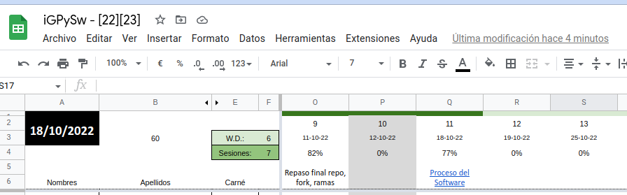

# Propuesta de mejora a la hoja de cálculo de asistencia

> [Estado](https://github.com/mmasias/iGPySw-22-23/pulls?q=is%3Apr+label%3AEvaluacionContinua-002+)

A la **[hoja de cálculo existente](https://docs.google.com/spreadsheets/d/19litnyt63ELTel4qMyb4U4_ggJ00z9TmZ6_O82o8_i4/edit?usp=sharing)**, que muestra en la parte superior dos colores (dos estados) correspondientes a clases pasadas y clases futuras, agregarle un tercer indicador, que corresponda a la clase del día de hoy.

|Situación actual
|-
|
|Se plantea que la hoja automáticamente muestre en otro color la celda Q1, puesto que corresponde al día de hoy (que puede inferirse del dato que está en la celda A2).

## Conceptos a utilizar

- Fórmulas
- Formato condicional

## La entrega  

> :heavy_exclamation_mark: **¡Muy importante!** No se aceptarán trabajos que no cumplan con estos criterios de entrega.

Mediante un enlace incluido en el archivo **nombreApellido.md**, en esta carpeta, que apunte a la hoja de solución propuesta.

La entrega debe realizarse hacia a la rama **Entrega-Evaluacion-Continua-2**

Fecha: Jueves 27 Oct 00:00h
