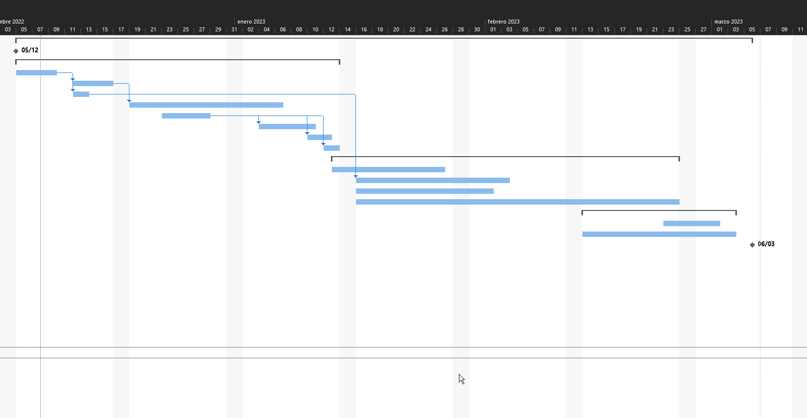

# Gantt Diagram

[Source](https://drive.google.com/drive/folders/1HkFeIQy2KyN-ulpORaF9TjPnfZ3fVoyF?usp=sharing "Source to Gantt Diagram")

---

### Indique las tareas que son críticas

- Recopilación de datos
- Planificación
- Pruebas y lanzamiento del sitio web
- Mantenimiento, formación y entrega

---

### Si el proyecto comienza el 05 de diciembre de 2022 ¿Cuál será el último día de ejecución del proyecto, si no tenemos retraso?

Su fecha final sera el 06/03/2023 sin retraso alguno

---

### ¿Y si tenemos un retraso de 5 días en la actividad 5?

Segun el analices que se realizo, este inicio tardio en la activdad de planificacion no afecta la fecha de entrega del proyecto.
