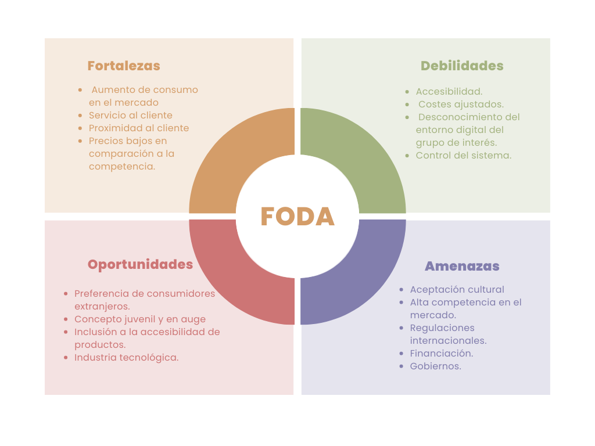

# Facilitador de Pago / DAFO

  
  

 

[Source](https://drive.google.com/drive/folders/1LUMWfTJkrcQqzM8WdLTZWvp9ZGD64F5m?usp=share_link)

## Análisis
El proyecto **Facilitador de Pago** busca implementar un sistema contactless en regiones del mundo donde no existe aún esta tecnología, así facilitando los consumos del usuario natural. En la actualidad este proyecto se encuentra en una etapa de investigación y prueba debido a las demandantes actividades que esta conlleva para salir a flote.   Entre las fortalezas de este proyecto se encuentran el aumento de consumo en los mercados y la ampliación a nuevos mercados de interés del consumidor natural. Además, aporta al comercio interno con el fin de mejorar la circulación monetaria. Las oportunidades de este proyecto se ven aferradas al crecimiento del sector tecnológico, así abriendo nuevos espacios de comercio en el extranjero debido a facilitar el método de pago de manera internacional.  
Entre sus debilidades está presente la aceptación o desconocimiento de estos sistemas a una cultura ya establecida y el control de este sistema. Al mismo tiempo, se ve amenazada directamente por las regulaciones internacionales y gobiernos a los que este proyecto es dirigido.

## Propuestas de Mejora

- **Experimentar antes de ingresar al mercado:**
  
- **Realizar un analisis independiente a cada region/mercado de interes:**
  
- **Optimizar la gestión de la demanda del producto:**
  
